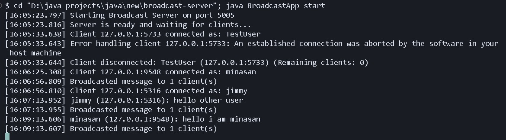
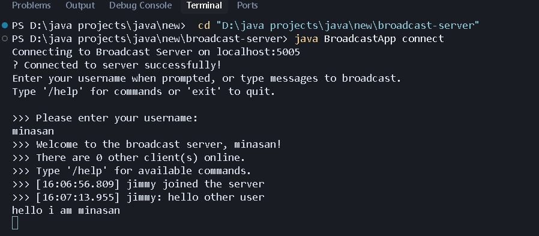
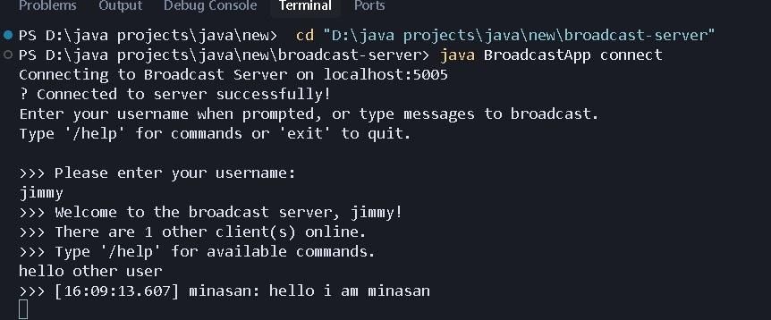

# Java Broadcast Server

A feature-rich Java-based broadcast server and client application with real-time messaging, username support, and command system.

## 📁 Project Structure

- **BroadcastApp.java** - Main entry point with command-line argument parsing
- **BroadcastServer.java** - Server implementation with multi-client support
- **BroadcastClient.java** - Client implementation with interactive interface
- **ClientHandler.java** - Individual client connection handler with username management

## 🚀 Quick Start

### Compilation
```bash
javac *.java
```

### Starting the Server
```bash
java BroadcastApp start
```

### Connecting a Client
```bash
java BroadcastApp connect
```

## ✨ Features

### Core Features
- ✅ **Multi-client support** - Handle multiple concurrent connections
- ✅ **Real-time broadcasting** - Messages instantly broadcast to all clients
- ✅ **Username system** - Custom usernames instead of IP addresses
- ✅ **Timestamps** - All messages include timestamps `[HH:MM:SS.mmm]`
- ✅ **Enhanced logging** - Detailed server logs with client counts
- ✅ **Graceful shutdown** - Proper cleanup on server/client disconnect

### Command System
- `/help` - Show available commands
- `/list` - List all connected users
- `/quit` - Disconnect from server (alternative to `exit`)
- `/name <newName>` - Change your username

### Command-Line Options
- Custom port: `java BroadcastApp start --port 8080`
- Custom host: `java BroadcastApp connect --host 192.168.1.100`
- Custom port: `java BroadcastApp connect --port 8080`
- Help: `java BroadcastApp help`

## 📖 Usage Guide

### Starting the Server

**Default port (5005):**
```bash
java BroadcastApp start
```

**Custom port:**
```bash
java BroadcastApp start --port 8080
```

### Connecting Clients

**Default connection (localhost:5005):**
```bash
java BroadcastApp connect
```

**Custom host and port:**
```bash
java BroadcastApp connect --host 192.168.1.100 --port 8080
```

### Client Interaction

1. **On connection**, you'll be prompted to enter a username
2. **Type messages** to broadcast them to all other connected clients
3. **Use commands** like `/help`, `/list`, `/name` for additional functionality
4. **Type `exit` or `/quit`** to disconnect

### Example Session

```
Connecting to Broadcast Server on localhost:5005
✓ Connected to server successfully!
Enter your username when prompted, or type messages to broadcast.
Type '/help' for commands or 'exit' to quit.

>>> Please enter your username:
Alice
>>> Welcome to the broadcast server, Alice!
>>> There are 2 other client(s) online.
>>> Type '/help' for available commands.
>>> [15:30:45.123] Bob joined the server
>>> [15:30:50.456] Bob: Hello everyone!
Hello Bob!
>>> [15:30:55.789] Alice: Hello Bob!
/list
>>> Connected users (3):
>>>   - Bob
>>>   - Charlie
/quit
Disconnecting...
```

## 🔧 Configuration

### Default Settings
- **Port:** 5005
- **Host:** localhost
- **Protocol:** TCP/IP

### Changing Default Port

Edit `BroadcastApp.java`:
```java
private static final int DEFAULT_PORT = 5005; // Change this value
```

## 📊 Server Logs

The server provides detailed logging with timestamps:
```
[15:45:54.995] Starting Broadcast Server on port 5005
[15:45:55.016] Server is ready and waiting for clients...
[15:45:57.647] New client connected: 127.0.0.1:9924 (Total clients: 1)
[15:45:57.651] Client 127.0.0.1:9924 connected as: Alice
[15:45:57.651] Received from Alice (127.0.0.1:9924): Hello!
[15:45:57.653] Broadcasted message to 2 client(s)
[15:46:00.123] Client disconnected: Alice (127.0.0.1:9924) (Remaining clients: 2)
```

## 🛠️ Technical Details

### Architecture
- **Server:** Multi-threaded server using `ServerSocket` and `ConcurrentHashMap`
- **Client:** Threaded client with separate receive/send threads
- **Thread Safety:** Uses `ConcurrentHashMap.newKeySet()` for thread-safe client management

### Error Handling
- Connection failure detection with clear error messages
- Graceful handling of client disconnections
- Server shutdown hook for clean termination
- Null safety checks throughout

## 📝 Notes

- The server must be running before clients can connect
- Only one server instance can run on a port at a time
- Messages are broadcast to all clients except the sender
- Empty messages are automatically filtered
- Usernames can be changed during a session using `/name`

## 🧪 Testing

Test the application by:
1. Starting the server in one terminal
2. Connecting multiple clients in separate terminals
3. Sending messages between clients
4. Testing commands like `/list` and `/help`

## 📸 Screenshots

### Broadcast Server


The server running and accepting client connections with detailed timestamped logs.

### Broadcast Client 1


First client connected to the server, sending and receiving messages.

### Broadcast Client 2


Second client connected, demonstrating multi-client broadcasting functionality.


